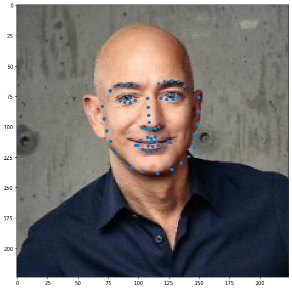

# Facial-Landmark-Detection
**The Objective of this project is to find the best CNN Model capable of predicting 68 Keypoints around the face, eyes, mouth, nose... using Pytorch**

* model.py : contains the model structure.
* data_load.py : contains classes to create dataset and apply transformations like normalization,cropping and transform the images to tensors.
* Train.ipynb : This notebook contains the data preprocessing and the training process as well as the test.
* Face_detection.ipynb : Apply Facedetection using HaarCascade classifiers and detect keypoints in different faces detected in the images.
